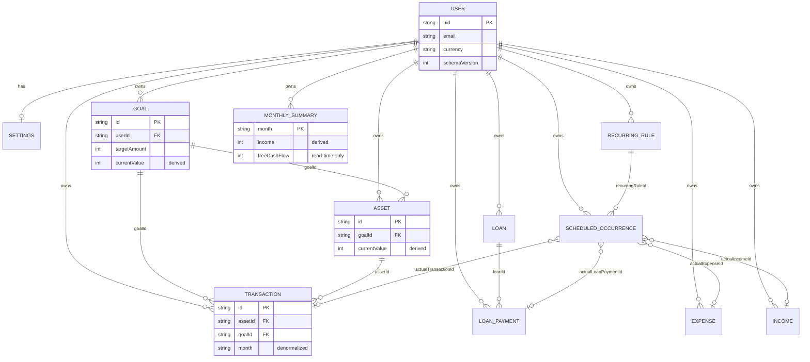

# Firestore Schema Audit

**Project:** Nirvana (personal finance tracker)  
**Audit date:** 2026-08-23  
**Schema version (code constant):** `2` (`src/firebase/schema.ts`)  
**Scope:** Current Firestore structure as implemented by this codebase, `firestore.rules`, `firestore.indexes.json`, and dev seed/migration utilities.  
**Method:** Static analysis only — no application code was modified.

---

## Table of Contents

1. [Executive Summary](#1-executive-summary)
2. [Firebase Initialization & Configuration](#2-firebase-initialization--configuration)
3. [Firestore Access Layer](#3-firestore-access-layer)
4. [Path Registry](#4-path-registry)
5. [Collection Reference](#5-collection-reference)
6. [Firestore Query Catalog](#6-firestore-query-catalog)
7. [Write Operations Catalog](#7-write-operations-catalog)
8. [Transactions & Batch Writes](#8-transactions--batch-writes)
9. [TypeScript Document Types](#9-typescript-document-types)
10. [Security Rules Summary](#10-security-rules-summary)
11. [Composite Indexes](#11-composite-indexes)
12. [Seed / Mock / Sample Data](#12-seed--mock--sample-data)
13. [Legacy Collections (V1)](#13-legacy-collections-v1)
14. [API Surface Not Found in Codebase](#14-api-surface-not-found-in-codebase)
15. [Appendix A — ER / Data Relationship Diagram](#appendix-a--er--data-relationship-diagram)
16. [Appendix B — Collection Tree](#appendix-b--collection-tree)
17. [Appendix C — Potential Normalization Problems](#appendix-c--potential-normalization-problems)
18. [Appendix D — Potential Redundant / Duplicated Data](#appendix-d--potential-redundant--duplicated-data)
19. [Appendix E — Potential Expensive Reads](#appendix-e--potential-expensive-reads)
20. [Appendix F — Missing Indexes](#appendix-f--missing-indexes)
21. [Appendix G — Security-Rule Concerns](#appendix-g--security-rule-concerns)
22. [Appendix H — Migration Risks](#appendix-h--migration-risks)

---

## 1. Executive Summary

Nirvana uses a **user-scoped, flat collection layout** under `users/{uid}/`. All finance data for a user lives as subcollections of their user document. The app migrated from a **nested V1 layout** (assets/transactions under goals, payments under loans) to a **flat V2 layout** (top-level `assets`, `transactions`, `loanPayments`, `recurringRules` under the user).

| Metric | Value |
|--------|-------|
| Active root collection | `users` |
| Active subcollections (V2) | 12 |
| Legacy subcollections (read-only in migration) | 4 path patterns |
| Real-time listeners (`onSnapshot`) | **0** — all reads are one-shot `getDoc` / `getDocs` |
| `collectionGroup()` usage in app code | **0** |
| `addDoc()` usage | **0** — writes use `setDoc` (via `upsert`) or `batch.set` / `transaction.set` |
| `deleteDoc()` usage | **0** — hard deletes use `batch.delete` (dev utility only) |
| Soft-delete pattern | `isDeleted: true` on most finance documents |
| Money storage | Integer minor units (paise/cents) in Firestore; validated as `int` in rules |
| Dates | ISO date strings `YYYY-MM-DD` (10 chars); months as `YYYY-MM` (7 chars) |

---

## 2. Firebase Initialization & Configuration

### 2.1 Config file

**File:** `src/firebase/config.ts`

| Setting | Source |
|---------|--------|
| `apiKey` | `VITE_FIREBASE_API_KEY` |
| `authDomain` | `VITE_FIREBASE_AUTH_DOMAIN` |
| `projectId` | `VITE_FIREBASE_PROJECT_ID` |
| `storageBucket` | `VITE_FIREBASE_STORAGE_BUCKET` |
| `messagingSenderId` | `VITE_FIREBASE_MESSAGING_SENDER_ID` |
| `appId` | `VITE_FIREBASE_APP_ID` |

`isFirebaseConfigured()` requires `VITE_FIREBASE_API_KEY`, `VITE_FIREBASE_PROJECT_ID`, and `VITE_FIREBASE_APP_ID`.

### 2.2 Firestore initialization

```ts
initializeFirestore(app, {
  localCache: persistentLocalCache({ tabManager: persistentMultipleTabManager() }),
})
```

- **Offline persistence:** enabled (multi-tab).
- **Emulator:** when `VITE_USE_FIREBASE_EMULATOR === 'true'`, connects to `localhost:8080` (Firestore) and `localhost:9099` (Auth).

### 2.3 Deployment config

**File:** `firebase.json`

```json
{
  "firestore": {
    "rules": "firestore.rules",
    "indexes": "firestore.indexes.json"
  },
  "emulators": { "auth": { "port": 9099 }, "firestore": { "port": 8080 }, "ui": { "port": 4000 } }
}
```

---

## 3. Firestore Access Layer

### 3.1 Core wrapper

**File:** `src/firebase/firestore.ts`

| Function | Underlying SDK | Purpose |
|----------|----------------|---------|
| `getDocument(path)` | `getDoc(doc(db, path))` | Single document read |
| `listDocuments(path)` | `getDocs(collection(db, path))` | Full collection read (no filters) |
| `queryDocuments(path, constraints)` | `getDocs(query(collection(...), ...))` | Filtered/ordered query |
| `queryDocumentsPage(path, constraints, pageSize, cursor?)` | `query` + `limit` + `startAfter` | Paginated query |
| `upsert(path, data)` | `setDoc(..., { merge: true })` | Create or merge-write |
| `patch(path, data)` | `updateDoc(...)` | Partial update |
| `newId(path)` | `doc(collection(db, path)).id` | Auto-generated document ID |
| `dbDoc(path)` | `doc(db, path)` | Document reference |
| `createWriteBatch()` | `writeBatch(db)` | Batch writer |
| `runDbTransaction(fn)` | `runTransaction(db, fn)` | Transaction runner |
| `flushPendingWrites()` | `waitForPendingWrites()` | Await pending writes |
| `stamp()` | — | `{ createdAt: serverTimestamp(), updatedAt: serverTimestamp() }` |
| `touch()` | — | `{ updatedAt: serverTimestamp() }` |
| `notDeleted()` | `where('isDeleted', '==', false)` | Soft-delete filter helper |
| `byField(field, value)` | `where(field, '==', value)` | Equality filter helper |
| `newestFirst(field?)` | `orderBy(field, 'desc')` | Default `orderBy('date', 'desc')` |

`clean()` strips `undefined` values before writes.

### 3.2 Service / repository files

| File | Role |
|------|------|
| `src/services/userService.ts` | User profile + settings reads/writes |
| `src/services/financeService.ts` | All finance CRUD, transactions, batches |
| `src/services/financeReads.ts` | All finance queries / loads |
| `src/services/financeMappers.ts` | Raw Firestore → TypeScript mapping + derived write fields |
| `src/firebase/paths.ts` | Canonical path builders |
| `src/dev/firestoreMigration.ts` | V1→V2 migration + derived-data rebuild (dev) |
| `src/dev/clearFinanceData.ts` | Soft-delete all finance data + hard-delete summaries (dev) |
| `src/dev/seedDemoData.ts` | Sample data seeder (dev) |

### 3.3 Context integration

| File | Firestore interaction |
|------|----------------------|
| `src/contexts/AuthContext.tsx` | Calls `userService` on auth state change |
| `src/contexts/FinanceContext.tsx` | Orchestrates reads/writes via services; triggers migration on load |

---

## 4. Path Registry

**File:** `src/firebase/paths.ts`

| Helper | Resolved path | Type |
|--------|---------------|------|
| `user(uid)` | `users/{uid}` | Root document |
| `settings(uid)` | `users/{uid}/settings/app` | Subcollection doc (fixed ID `app`) |
| `legacySettings(uid)` | `users/{uid}/profile/settings` | Legacy settings doc |
| `goals(uid)` | `users/{uid}/goals` | Subcollection |
| `goal(uid, goalId)` | `users/{uid}/goals/{goalId}` | Document |
| `assets(uid)` | `users/{uid}/assets` | Subcollection |
| `asset(uid, assetId)` | `users/{uid}/assets/{assetId}` | Document |
| `transactions(uid)` | `users/{uid}/transactions` | Subcollection |
| `transaction(uid, txId)` | `users/{uid}/transactions/{txId}` | Document |
| `loans(uid)` | `users/{uid}/loans` | Subcollection |
| `loan(uid, loanId)` | `users/{uid}/loans/{loanId}` | Document |
| `loanPayments(uid)` | `users/{uid}/loanPayments` | Subcollection |
| `loanPayment(uid, paymentId)` | `users/{uid}/loanPayments/{paymentId}` | Document |
| `expenses(uid)` | `users/{uid}/expenses` | Subcollection |
| `expense(uid, expenseId)` | `users/{uid}/expenses/{expenseId}` | Document |
| `income(uid)` | `users/{uid}/income` | Subcollection |
| `incomeItem(uid, incomeId)` | `users/{uid}/income/{incomeId}` | Document |
| `recurringRules(uid)` | `users/{uid}/recurringRules` | Subcollection |
| `recurringRule(uid, id)` | `users/{uid}/recurringRules/{id}` | Document |
| `scheduledOccurrences(uid)` | `users/{uid}/scheduledOccurrences` | Subcollection |
| `scheduledOccurrence(uid, id)` | `users/{uid}/scheduledOccurrences/{id}` | Document |
| `monthlySummaries(uid)` | `users/{uid}/monthlySummaries` | Subcollection |
| `monthlySummary(uid, month)` | `users/{uid}/monthlySummaries/{month}` | Document (ID = `YYYY-MM`) |

---

## 5. Collection Reference

### 5.1 `users/{uid}` (root document)

| Property | Value |
|----------|-------|
| **Full path** | `users/{uid}` |
| **Type** | Root collection document |
| **Document ID strategy** | Firebase Auth UID |
| **Written by** | `userService.ensureUserProfile`, `userService.updateSettings`, `userService.completeOnboarding`, `firestoreMigration.migrateFirestoreV1` |
| **Read by** | `userService`, `financeReads.getUserSchemaVersion`, `financeService.exportUserData` |

#### Fields

| Field | Type | Required | Default (on create) | Notes |
|-------|------|----------|---------------------|-------|
| `uid` | `string` | Yes (rules) | Auth UID | Must equal document path `{uid}` |
| `displayName` | `string` | Yes (rules) | `'there'` or Auth display name | Synced from Auth on login |
| `email` | `string` | Yes (rules) | Auth email or `''` | |
| `photoURL` | `string \| null` | Optional | Auth photo or `null` | |
| `country` | `string` | Optional in rules | `'IN'` | Duplicated on settings |
| `currency` | `enum` | Yes (rules) | `'INR'` | `INR\|USD\|EUR\|GBP\|SGD\|AED`; duplicated on settings |
| `onboardingComplete` | `boolean` | Optional | `false` | |
| `schemaVersion` | `number` | Optional | `1` on create; set to `2` after migration | |
| `createdAt` | `Timestamp` | Written | `serverTimestamp()` | Mapped to ISO string in app |
| `updatedAt` | `Timestamp` | Written | `serverTimestamp()` | |

#### Query / filter / order fields

None — always read by direct document path.

#### Screens

| Screen | Action |
|--------|--------|
| Login / Auth bootstrap | Read + create on first sign-in |
| Onboarding | Update `country`, `currency`, `onboardingComplete` |
| Profile | Read; settings save may patch `currency`/`country` |
| FinanceContext (all screens) | Migration reads `schemaVersion` |

---

### 5.2 `users/{uid}/settings/app`

| Property | Value |
|----------|-------|
| **Full path** | `users/{uid}/settings/app` |
| **Type** | Subcollection document (collection `settings`, fixed doc ID `app`) |
| **Document ID strategy** | Hard-coded `app` |
| **Legacy path** | `users/{uid}/profile/settings` (read + one-time copy to `settings/app`) |

#### Fields

| Field | Type | Required | Default | Notes |
|-------|------|----------|---------|-------|
| `currency` | `enum` | Yes (rules) | `'INR'` | |
| `country` | `string` | Optional | `'IN'` | |
| `dashboardMonth` | `string` | Optional | Current `YYYY-MM` | Controls dashboard month |
| `theme` | `enum` | Yes (rules) | `'light'` | `light\|dark\|system` |
| `createdAt` | `Timestamp` | Written | `serverTimestamp()` | |
| `updatedAt` | `Timestamp` | Written | `serverTimestamp()` | |

#### Screens

| Screen | Action |
|--------|--------|
| Auth bootstrap | Read / create |
| Profile | Read + update |
| Onboarding | Update via `completeOnboarding` |
| Dashboard / Statements | Read `dashboardMonth` |

---

### 5.3 `users/{uid}/goals/{goalId}`

| Property | Value |
|----------|-------|
| **Full path** | `users/{uid}/goals/{goalId}` |
| **Type** | Subcollection |
| **Document ID strategy** | Auto-generated (`newId`) |
| **Delete strategy** | Soft delete: `isDeleted: true`, `status: 'paused'` |

#### Fields

| Field | Type | Required on write | Default (create) | Derived / denormalized |
|-------|------|-------------------|------------------|------------------------|
| `id` | `string` | Yes | Auto ID | Duplicated in document body |
| `userId` | `string` | Yes (create rules) | Auth UID | |
| `name` | `string` | Yes | — | |
| `description` | `string` | Optional | — | |
| `targetAmount` | `int` | Yes | — | Minor units |
| `startDate` | `string` | Written by app | Input | `YYYY-MM-DD`; not validated in rules |
| `targetDate` | `string` | Written by app | Input | |
| `priority` | `enum` | Written by app | Input | `low\|medium\|high` |
| `status` | `enum` | Written by app | Input | `active\|completed\|paused` |
| `currentValue` | `int` | Optional | `0` on create | **Derived** from child assets; refreshed on asset/tx changes |
| `investedAmount` | `int` | Optional | `0` | **Derived** |
| `withdrawnAmount` | `int` | Optional | `0` | **Derived** |
| `netInvestedAmount` | `int` | Optional | `0` | **Derived** |
| `monthlyInvestment` | `int` | Optional | `0` | **Derived** (sum of asset SIPs) |
| `isDeleted` | `boolean` | Written | `false` | |
| `createdAt` | `Timestamp` | Written | `serverTimestamp()` | |
| `updatedAt` | `Timestamp` | Written | `serverTimestamp()` | |

#### Relationships

- Parent: `users/{uid}`
- Children (logical): `assets` where `goalId == goalId`
- Referenced by: `transactions.goalId`, `scheduledOccurrences.goalId`, `recurringRules.goalId`

#### Query fields

| Operation | Filters | Ordering | Code location |
|-----------|---------|----------|---------------|
| List all goals | None (client filters `!isDeleted`) | None | `loadCoreFinanceData`, `loadDerivedSummaries`, `loadAllFinanceRecords` |

#### Screens

| Screen | Reads | Writes |
|--------|-------|--------|
| Dashboard | List (via context) | — |
| Wealth | List | `addGoal` |
| Goal Detail | Single goal from context | `editGoal`, `removeGoal` |
| Notifications | Indirect (occurrences) | — |
| Profile (dev) | Export | Migration rebuild |

---

### 5.4 `users/{uid}/assets/{assetId}`

| Property | Value |
|----------|-------|
| **Full path** | `users/{uid}/assets/{assetId}` |
| **Type** | Subcollection (flat V2; was nested under goal in V1) |
| **Document ID strategy** | Auto-generated |
| **Delete strategy** | Soft delete: `isDeleted: true`, `isActive: false` |

#### Fields

| Field | Type | Required | Default | Notes |
|-------|------|----------|---------|-------|
| `id` | `string` | Yes | Auto ID | |
| `userId` | `string` | Yes (create) | Auth UID | |
| `goalId` | `string` | Yes (rules) | Input | FK → goals |
| `name` | `string` | Yes | Input | |
| `category` | `enum` | Written | `'OTHER'` | `MF\|FD\|RD\|ETF\|STOCK\|GOLD\|PPF\|NPS\|CASH\|OTHER` |
| `source` | `enum` | Written | `'OTHER'` | `ZERODHA\|GROWW\|BANK\|OTHER` |
| `investmentType` | `enum` | Written | `'SIP'` | `SIP\|LUMP_SUM\|BOTH` |
| `investedAmount` | `int` | Yes (rules) | Input / derived | |
| `currentValue` | `int` | Yes (rules) | Input / derived | |
| `withdrawnAmount` | `int` | Written | Derived | **Denormalized alias** of `totalWithdrawals` |
| `totalWithdrawals` | `int` | Written | Input / derived | Both fields written together |
| `netInvestedAmount` | `int` | Written | **Derived** | `investedAmount - withdrawnAmount` |
| `gainAmount` | `int` | Written | **Derived** | |
| `returnPercentage` | `number` | Written | **Derived** | |
| `expectedCagr` | `number` | Optional | — | |
| `monthlyInvestment` | `int` | Optional | — | Drives virtual recurring `asset_{id}` |
| `plannedInvestmentDay` | `number` | Optional | — | App field name |
| `plannedDay` | `number` | Written | From `plannedInvestmentDay` | **Denormalized alias** |
| `startDate` | `string` | Optional | — | |
| `endDate` | `string` | Optional | — | |
| `notes` | `string` | Optional | — | |
| `isActive` | `boolean` | Written | `true` | |
| `isDeleted` | `boolean` | Written | `false` | |
| `createdAt` | `Timestamp` | Written | `serverTimestamp()` or ISO on create | |
| `updatedAt` | `Timestamp` | Written | `serverTimestamp()` | |

#### Query fields

| Filters | Ordering | Purpose |
|---------|----------|---------|
| `isDeleted == false` | — | Load all active assets |
| `isDeleted == false`, `goalId == {id}` | — | Goal detail assets |
| `isDeleted == false` | `date desc` | **NOT USED** for assets |

#### Screens

| Screen | Reads | Writes |
|--------|-------|--------|
| Dashboard | All active assets | — |
| Wealth | All active assets | — |
| Goal Detail | By `goalId` | `addAsset`, `editAsset`, `removeAsset` |
| Quick Sheets | From context | Transaction needs asset |
| Notifications | From context | Investment occurrences |

---

### 5.5 `users/{uid}/transactions/{txId}`

| Property | Value |
|----------|-------|
| **Full path** | `users/{uid}/transactions/{txId}` |
| **Type** | Subcollection (flat V2) |
| **Document ID strategy** | Auto-generated |
| **Delete strategy** | Soft delete (`isDeleted: true`) + reverse derived updates in transaction |

#### Fields

| Field | Type | Required | Default | Notes |
|-------|------|----------|---------|-------|
| `id` | `string` | Yes | Auto ID | |
| `userId` | `string` | Yes (create) | Auth UID | |
| `assetId` | `string` | Yes (rules) | Input | FK → assets |
| `goalId` | `string` | Yes (rules) | Input | FK → goals |
| `type` | `enum` | Yes | Input | `INVESTMENT\|WITHDRAWAL\|VALUE_UPDATE` |
| `amount` | `int` | Yes | Input | |
| `date` | `string` | Yes | Input | `YYYY-MM-DD` |
| `month` | `string` | Written | `monthKeyFromDate(date)` | `YYYY-MM`; denormalized for queries |
| `note` | `string` | Optional | — | |
| `source` | `string` | Written on create | Copied from asset `source` | Denormalized |
| `isDeleted` | `boolean` | Written | `false` | |
| `createdAt` | `Timestamp` | Written | `serverTimestamp()` | |
| `updatedAt` | `Timestamp` | Written on patch/delete | `serverTimestamp()` | |

#### Query fields

| Filters | Ordering | Purpose |
|---------|----------|---------|
| `isDeleted == false` | `date desc` | Recent activity / pagination |
| `isDeleted == false`, `goalId == {id}` | `date desc` | Goal detail |
| `isDeleted == false`, `month == {m}` | `date desc` | Monthly statement |
| `isDeleted == false`, `date >= {start}` | None (fallback sorts client-side) | Wealth history chart |
| `isDeleted == false` | None | Full export (`loadAllFinanceRecords`) |

#### Screens

| Screen | Reads | Writes |
|--------|-------|--------|
| Dashboard | Recent + history | — |
| Wealth | Recent + paginated | — |
| Goal Detail | By `goalId` | `addTransaction`, `removeTransaction` |
| Statements | By `month` | — |
| Quick Sheets | — | `addTransaction` |
| Notifications | — | Via `recordOccurrence` → `createTransaction` |

---

### 5.6 `users/{uid}/loans/{loanId}`

| Property | Value |
|----------|-------|
| **Full path** | `users/{uid}/loans/{loanId}` |
| **Type** | Subcollection |
| **Document ID strategy** | Auto-generated |
| **Delete strategy** | Soft delete: `isDeleted: true`, `status: 'CLOSED'` |

#### Fields

| Field | Type | Required | Default | Notes |
|-------|------|----------|---------|-------|
| `id` | `string` | Yes | Auto ID | |
| `userId` | `string` | Yes (create) | Auth UID | |
| `name` | `string` | Yes | Input | |
| `description` | `string` | Optional | — | |
| `purpose` | `string` | Optional | — | |
| `bank` | `string` | Written | `''` if missing | |
| `originalAmount` | `int` | Yes | Input | |
| `outstandingAmount` | `int` | Yes | Input / derived | Updated on loan payment |
| `totalPaid` | `int` | Written | **Derived** | `originalAmount - outstandingAmount` |
| `progressPercentage` | `number` | Written | **Derived** | |
| `interestRate` | `number` | Written | `0` | Not validated in rules |
| `tenureMonths` | `number` | Written | `0` | |
| `startDate` | `string` | Written | Input | |
| `endDate` | `string` | Optional | — | |
| `emiAmount` | `int` | Written | Input | Drives virtual recurring `loan_{id}` |
| `emiDate` | `number` | Written | `1` | Day of month |
| `deductionBank` | `string` | Written | `''` | |
| `status` | `enum` | Written | `'ACTIVE'` | `ACTIVE\|CLOSED` |
| `isDeleted` | `boolean` | Written | `false` | |
| `createdAt` | `Timestamp` | Written | `serverTimestamp()` | |
| `updatedAt` | `Timestamp` | Written | `serverTimestamp()` | |

#### Query fields

Full collection list (no server-side filters); client filters `!isDeleted`.

#### Screens

| Screen | Reads | Writes |
|--------|-------|--------|
| Dashboard | List | — |
| Loans | List + detail | `addLoan`, `editLoan`, `removeLoan` |
| Quick Sheets | — | `addLoanPayment` |
| Notifications | — | Loan payment occurrences |

---

### 5.7 `users/{uid}/loanPayments/{paymentId}`

| Property | Value |
|----------|-------|
| **Full path** | `users/{uid}/loanPayments/{paymentId}` |
| **Type** | Subcollection (flat V2; was `loans/{id}/payments` in V1) |
| **Document ID strategy** | Auto-generated |
| **Delete strategy** | **No delete function in app code** — UNKNOWN / NOT FOUND IN CODEBASE |

#### Fields

| Field | Type | Required | Default | Notes |
|-------|------|----------|---------|-------|
| `id` | `string` | Yes | Auto ID | |
| `userId` | `string` | Yes (create) | Auth UID | |
| `loanId` | `string` | Yes (rules) | Input | FK → loans |
| `amount` | `int` | Yes | Input | |
| `principalAmount` | `int` | Optional | Defaults to `amount` in outstanding calc | |
| `interestAmount` | `int` | Optional | — | |
| `date` | `string` | Yes | Input | |
| `month` | `string` | Written | From date | Denormalized |
| `note` | `string` | Optional | — | |
| `isDeleted` | `boolean` | Written | `false` | Dev clear utility only |
| `createdAt` | `Timestamp` | Written | `serverTimestamp()` | |
| `updatedAt` | `Timestamp` | Optional | — | |

#### Query fields

| Filters | Ordering | Purpose |
|---------|----------|---------|
| `isDeleted == false` | `date desc` | Recent / paginated |
| `isDeleted == false`, `loanId == {id}` | `date desc` | Loan detail |
| `isDeleted == false`, `month == {m}` | `date desc` | Statement month |

#### Screens

| Screen | Reads | Writes |
|--------|-------|--------|
| Dashboard | Recent payments | — |
| Loans (detail) | By `loanId` | `addLoanPayment` |
| Statements | By `month` | — |
| Quick Sheets | — | `addLoanPayment` |
| Notifications | — | Via `recordOccurrence` |

---

### 5.8 `users/{uid}/expenses/{expenseId}`

| Property | Value |
|----------|-------|
| **Full path** | `users/{uid}/expenses/{expenseId}` |
| **Type** | Subcollection |
| **Document ID strategy** | Auto-generated |
| **Delete strategy** | Soft delete + reverse monthly summary delta |

#### Fields

| Field | Type | Required | Default | Notes |
|-------|------|----------|---------|-------|
| `id` | `string` | Yes | Auto ID | |
| `userId` | `string` | Yes (create) | Auth UID | |
| `amount` | `int` | Yes | Input | |
| `category` | `string` | Written | Input | See `EXPENSE_CATEGORIES` |
| `description` | `string` | Optional | — | |
| `date` | `string` | Yes | Input | |
| `month` | `string` | Written | From date | Denormalized |
| `paymentSource` | `string` | Optional | — | `Cash\|Bank\|Credit Card\|UPI\|Other` |
| `isDeleted` | `boolean` | Written | `false` | |
| `createdAt` | `Timestamp` | Written | `serverTimestamp()` | |
| `updatedAt` | `Timestamp` | Written | `serverTimestamp()` | |

**Special behavior:** `category === 'EMI'` updates `loanPayments` on monthly summary instead of `expenses`.

#### Query fields

| Filters | Ordering | Purpose |
|---------|----------|---------|
| `isDeleted == false`, `month == {m}` | `date desc` | Statement month |
| `isDeleted == false` | None | Full export |

#### Screens

| Screen | Reads | Writes |
|--------|-------|--------|
| Statements | By month | `removeExpense` |
| Quick Sheets | — | `addExpense` |
| Notifications | — | Via `recordOccurrence` |

---

### 5.9 `users/{uid}/income/{incomeId}`

| Property | Value |
|----------|-------|
| **Full path** | `users/{uid}/income/{incomeId}` |
| **Type** | Subcollection |
| **Document ID strategy** | Auto-generated |
| **Delete strategy** | Soft delete + reverse monthly summary |

#### Fields

| Field | Type | Required | Default | Notes |
|-------|------|----------|---------|-------|
| `id` | `string` | Yes | Auto ID | |
| `userId` | `string` | Yes (create) | Auth UID | |
| `amount` | `int` | Yes | Input | |
| `source` | `string` | Written | `'Other'` | |
| `description` | `string` | Optional | — | |
| `date` | `string` | Yes | Input | |
| `month` | `string` | Written | From date | Denormalized |
| `isDeleted` | `boolean` | Written | `false` | |
| `createdAt` | `Timestamp` | Written | `serverTimestamp()` | |
| `updatedAt` | `Timestamp` | Optional | — | |

#### Query fields

| Filters | Ordering | Purpose |
|---------|----------|---------|
| `isDeleted == false`, `month == {m}` | `date desc` | Statement month |
| `isDeleted == false` | None | Full export |

#### Screens

| Screen | Reads | Writes |
|--------|-------|--------|
| Statements | By month | `removeIncome` |
| Quick Sheets | — | `addIncome` |
| Notifications | — | Via `recordOccurrence` |

---

### 5.10 `users/{uid}/recurringRules/{ruleId}`

| Property | Value |
|----------|-------|
| **Full path** | `users/{uid}/recurringRules/{ruleId}` |
| **Type** | Subcollection |
| **Document ID strategy** | Auto-generated for manual rules; virtual rules use `asset_{assetId}` / `loan_{loanId}` in memory only |
| **Note** | App persists manual recurring activities here. Rules file also defines `recurringActivities` collection — see [Legacy](#13-legacy-collections-v1). |

#### Fields (persisted)

| Field | Type | Required | Default | Alias fields |
|-------|------|----------|---------|--------------|
| `id` | `string` | Yes | Auto ID | |
| `userId` | `string` | Yes (create) | Auth UID | |
| `type` | `enum` | Yes | Input | `INVESTMENT\|LOAN_PAYMENT\|INCOME\|EXPENSE` |
| `name` | `string` | Yes | Input | |
| `amount` | `int` | Yes | Input | |
| `frequency` | `enum` | Written | `'MONTHLY'` | Only `MONTHLY` used |
| `scheduledDay` | `number` | Written | Input | |
| `dayOfMonth` | `number` | Written | From `scheduledDay` | **Denormalized alias** |
| `startDate` | `string` | Yes | Input | |
| `endDate` | `string` | Optional | — | |
| `goalId` | `string` | Optional | — | |
| `assetId` | `string` | Optional | — | |
| `loanId` | `string` | Optional | — | |
| `expenseCategory` | `string` | Optional | — | |
| `incomeSource` | `string` | Optional | — | |
| `status` | `enum` | Written | Input | `ACTIVE\|PAUSED` |
| `isActive` | `boolean` | Written | `status === 'ACTIVE'` | **Denormalized alias** |
| `sourceEntityId` | `string` | Optional | `'manual'` default type | |
| `sourceEntityType` | `enum` | Written | `'manual'` | `asset\|loan\|manual` |
| `isDeleted` | `boolean` | Written | `false` | |
| `createdAt` | `Timestamp` | Written | `serverTimestamp()` | |
| `updatedAt` | `Timestamp` | Written | `serverTimestamp()` | |

#### Query fields

Full collection list; no server-side filters in app code.

#### Screens

| Screen | Reads | Writes |
|--------|-------|--------|
| Notifications | List (core load) | `addRecurringActivity` |
| RecurringActivitiesPanel | Merged (manual + derived) | `editRecurringActivity`, `removeRecurringActivity` |

---

### 5.11 `users/{uid}/scheduledOccurrences/{occurrenceId}`

| Property | Value |
|----------|-------|
| **Full path** | `users/{uid}/scheduledOccurrences/{occurrenceId}` |
| **Type** | Subcollection |
| **Document ID strategy** | Deterministic: `{recurringActivityId}_{scheduledDate}` (`occurrenceId()` in `recurring.ts`) |

#### Fields

| Field | Type | Required | Default | Notes |
|-------|------|----------|---------|-------|
| `id` | `string` | Yes | Deterministic | |
| `userId` | `string` | Yes (create) | Auth UID | |
| `recurringActivityId` | `string` | Written | From activity | App field |
| `recurringRuleId` | `string` | Written | Same as above | **Denormalized alias** |
| `type` | `enum` | Written | From activity | |
| `name` | `string` | Written | From activity | |
| `expectedAmount` | `int` | Written | From activity | App field |
| `amount` | `int` | Written | Same as `expectedAmount` | **Denormalized alias** |
| `scheduledDate` | `string` | Yes | Computed | |
| `month` | `string` | Written | `scheduledDate.slice(0,7)` | |
| `status` | `enum` | Yes | Computed | `UPCOMING\|DUE\|OVERDUE\|RECORDED\|SKIPPED` |
| `goalId` | `string` | Optional | — | |
| `assetId` | `string` | Optional | — | |
| `loanId` | `string` | Optional | — | |
| `expenseCategory` | `string` | Optional | — | |
| `incomeSource` | `string` | Optional | — | |
| `actualTransactionId` | `string` | Optional | Set on record | FK → transactions |
| `actualLoanPaymentId` | `string` | Optional | Set on record | FK → loanPayments |
| `actualExpenseId` | `string` | Optional | Set on record | FK → expenses |
| `actualIncomeId` | `string` | Optional | Set on record | FK → income |
| `actualAmount` | `int` | Optional | On record | |
| `actualDate` | `string` | Optional | On record | |
| `skipReason` | `string` | Optional | On skip | |
| `recordedAt` | `string` | Optional | ISO timestamp | |
| `syncState` | `enum` | Optional | `'SYNCED'` | `PENDING\|SYNCED` |
| `isDeleted` | `boolean` | Written | `false` | |
| `createdAt` | `Timestamp` | Written | `serverTimestamp()` | |
| `updatedAt` | `Timestamp` | Written | `serverTimestamp()` | |

#### Query fields

| Filters | Ordering | Purpose |
|---------|----------|---------|
| `status in ['UPCOMING','DUE','OVERDUE']` | None | `limit(50)` notifications |
| Full list | None | Export / sync |

#### Screens

| Screen | Reads | Writes |
|--------|-------|--------|
| Dashboard / Notifications | Active occurrences | `recordOccurrence`, `skipOccurrence` |
| FinanceContext | Sync on load | `syncScheduledOccurrences` (batch) |

---

### 5.12 `users/{uid}/monthlySummaries/{month}`

| Property | Value |
|----------|-------|
| **Full path** | `users/{uid}/monthlySummaries/{month}` |
| **Type** | Subcollection |
| **Document ID strategy** | Month key `YYYY-MM` |
| **Delete strategy** | Rules disallow delete; dev utility uses `batch.delete` |

#### Fields

| Field | Type | Required | Default | Notes |
|-------|------|----------|---------|-------|
| `month` | `string` | Written | Doc ID | |
| `income` | `int` | Yes (rules) | `0` | **Derived** aggregate |
| `expenses` | `int` | Yes (rules) | `0` | **Derived** |
| `investments` | `int` | Yes (rules) | `0` | **Derived** |
| `withdrawals` | `int` | Yes (rules) | `0` | **Derived** |
| `loanPayments` | `int` | Yes (rules) | `0` | **Derived** |
| `transactionCount` | `int` | Written | `0` | **Derived** |
| `freeCashFlow` | `number` | **NOT persisted** | Computed on read | `income - expenses - loanPayments - investments + withdrawals` |
| `updatedAt` | `Timestamp` | Written | `serverTimestamp()` | |

#### Query fields

Always read by direct path `monthlySummaries/{YYYY-MM}` or full list for export.

#### Screens

| Screen | Reads | Writes |
|--------|-------|--------|
| Dashboard | Current month summary | Indirect via tx/expense/income/payment creates |
| Statements | Per-month summary | Indirect |
| Profile (dev) | Export / rebuild | Migration, rebuild |

---

## 6. Firestore Query Catalog

Constants: `ACTIVITY_PAGE_SIZE = 30`, `NOTIFICATION_QUERY_LIMIT = 50`.

All queries use `collection()` via path strings — **no `collectionGroup()` in application code**.

### Q1 — Active assets (all)

| Field | Value |
|-------|-------|
| **Collection** | `users/{uid}/assets` |
| **Query** | `query(collection, where('isDeleted','==',false))` |
| **Filters** | `isDeleted == false` |
| **Ordering** | None |
| **Limit** | None |
| **Purpose** | Load all active assets for dashboard/wealth |
| **Screen/feature** | Dashboard, Wealth, FinanceContext bootstrap |
| **Required composite index** | Single-field on `isDeleted` (automatic) |

### Q2 — Assets by goal

| Field | Value |
|-------|-------|
| **Collection** | `users/{uid}/assets` |
| **Query** | `notDeleted(), byField('goalId', goalId)` |
| **Filters** | `isDeleted == false`, `goalId == {goalId}` |
| **Ordering** | None |
| **Limit** | None |
| **Purpose** | Goal detail assets; refresh goal summary |
| **Screen/feature** | Goal Detail, `refreshGoalSummary`, transactions |
| **Required composite index** | `isDeleted ASC, goalId ASC` — **defined** in `firestore.indexes.json` |

### Q3 — All goals

| Field | Value |
|-------|-------|
| **Collection** | `users/{uid}/goals` |
| **Query** | `listDocuments` (no constraints) |
| **Filters** | None (client: `!isDeleted`) |
| **Ordering** | None |
| **Limit** | None |
| **Purpose** | Load goals |
| **Screen/feature** | All finance screens via context |
| **Required composite index** | None |

### Q4 — All loans

| Field | Value |
|-------|-------|
| **Collection** | `users/{uid}/loans` |
| **Query** | `listDocuments` |
| **Filters** | None (client: `!isDeleted`) |
| **Ordering** | None |
| **Limit** | None |
| **Purpose** | Load loans |
| **Screen/feature** | Dashboard, Loans |
| **Required composite index** | None |

### Q5 — Actionable scheduled occurrences

| Field | Value |
|-------|-------|
| **Collection** | `users/{uid}/scheduledOccurrences` |
| **Query** | `where('status','in',['UPCOMING','DUE','OVERDUE']), limit(50)` |
| **Filters** | `status IN (...)` |
| **Ordering** | None |
| **Limit** | `50` |
| **Purpose** | Notification / due-item feed |
| **Screen/feature** | Dashboard (`NotificationsTab`) |
| **Required composite index** | UNKNOWN — may work with automatic indexes; no `orderBy` combined |

### Q6 — All recurring rules

| Field | Value |
|-------|-------|
| **Collection** | `users/{uid}/recurringRules` |
| **Query** | `listDocuments` |
| **Filters** | None (client: `!isDeleted`) |
| **Ordering** | None |
| **Limit** | None |
| **Purpose** | Manual recurring activities |
| **Screen/feature** | Notifications, RecurringActivitiesPanel |
| **Required composite index** | None |

### Q7 — Current monthly summary

| Field | Value |
|-------|-------|
| **Collection** | `users/{uid}/monthlySummaries/{month}` |
| **Query** | `getDocument` (direct path) |
| **Filters** | N/A |
| **Ordering** | N/A |
| **Limit** | 1 doc |
| **Purpose** | Dashboard month rollup |
| **Screen/feature** | Dashboard, Statements |
| **Required composite index** | None |

### Q8 — Statement month expenses

| Field | Value |
|-------|-------|
| **Collection** | `users/{uid}/expenses` |
| **Query** | `notDeleted(), byField('month', month), newestFirst()` |
| **Filters** | `isDeleted == false`, `month == {YYYY-MM}` |
| **Ordering** | `date DESC` |
| **Limit** | None |
| **Purpose** | Monthly statement expenses |
| **Screen/feature** | Statements (`ensureStatementMonth`) |
| **Required composite index** | `isDeleted ASC, month ASC, date DESC` — **defined** |

### Q9 — Statement month income

| Field | Value |
|-------|-------|
| **Collection** | `users/{uid}/income` |
| **Query** | `notDeleted(), byField('month', month), newestFirst()` |
| **Filters** | `isDeleted == false`, `month == {YYYY-MM}` |
| **Ordering** | `date DESC` |
| **Limit** | None |
| **Purpose** | Monthly statement income |
| **Screen/feature** | Statements |
| **Required composite index** | `isDeleted ASC, month ASC, date DESC` — **defined** |

### Q10 — Statement month transactions

| Field | Value |
|-------|-------|
| **Collection** | `users/{uid}/transactions` |
| **Query** | `notDeleted(), byField('month', month), newestFirst()` |
| **Filters** | `isDeleted == false`, `month == {YYYY-MM}` |
| **Ordering** | `date DESC` |
| **Limit** | None |
| **Purpose** | Monthly statement investments |
| **Screen/feature** | Statements |
| **Required composite index** | `isDeleted ASC, month ASC, date DESC` — **defined** |

### Q11 — Statement month loan payments

| Field | Value |
|-------|-------|
| **Collection** | `users/{uid}/loanPayments` |
| **Query** | `notDeleted(), byField('month', month), newestFirst()` |
| **Filters** | `isDeleted == false`, `month == {YYYY-MM}` |
| **Ordering** | `date DESC` |
| **Limit** | None |
| **Purpose** | Monthly statement loan payments |
| **Screen/feature** | Statements |
| **Required composite index** | `isDeleted ASC, month ASC, date DESC` — **defined** |

### Q12 — Goal detail transactions

| Field | Value |
|-------|-------|
| **Collection** | `users/{uid}/transactions` |
| **Query** | `notDeleted(), byField('goalId', goalId), newestFirst()` |
| **Filters** | `isDeleted == false`, `goalId == {id}` |
| **Ordering** | `date DESC` |
| **Limit** | None |
| **Purpose** | Goal transaction history |
| **Screen/feature** | Goal Detail |
| **Required composite index** | `isDeleted ASC, goalId ASC, date DESC` — **defined** |

### Q13 — Loan detail payments

| Field | Value |
|-------|-------|
| **Collection** | `users/{uid}/loanPayments` |
| **Query** | `notDeleted(), byField('loanId', loanId), newestFirst()` |
| **Filters** | `isDeleted == false`, `loanId == {id}` |
| **Ordering** | `date DESC` |
| **Limit** | None |
| **Purpose** | Loan payment history |
| **Screen/feature** | Loans (detail route) |
| **Required composite index** | `isDeleted ASC, loanId ASC, date DESC` — **defined** |

### Q14 — Recent transactions (paginated)

| Field | Value |
|-------|-------|
| **Collection** | `users/{uid}/transactions` |
| **Query** | `notDeleted(), newestFirst(), limit(30), startAfter(cursor?)` |
| **Filters** | `isDeleted == false` |
| **Ordering** | `date DESC` |
| **Limit** | `30` (+ cursor) |
| **Purpose** | Recent wealth activity feed |
| **Screen/feature** | Dashboard, Wealth (`loadMoreWealthActivity`) |
| **Required composite index** | `isDeleted ASC, date DESC` — **defined** |
| **Fallback** | On index error: fetch without `orderBy`, sort client-side |

### Q15 — Recent loan payments (paginated)

| Field | Value |
|-------|-------|
| **Collection** | `users/{uid}/loanPayments` |
| **Query** | `notDeleted(), newestFirst(), limit(30), startAfter(cursor?)` |
| **Filters** | `isDeleted == false` |
| **Ordering** | `date DESC` |
| **Limit** | `30` |
| **Purpose** | Recent loan activity |
| **Screen/feature** | Dashboard, Loans |
| **Required composite index** | `isDeleted ASC, date DESC` — **defined** |

### Q16 — Wealth history transactions

| Field | Value |
|-------|-------|
| **Collection** | `users/{uid}/transactions` |
| **Query** | `notDeleted(), where('date','>=', startDate)` |
| **Filters** | `isDeleted == false`, `date >= {YYYY-MM-01}` |
| **Ordering** | None |
| **Limit** | None |
| **Purpose** | ~13-month wealth chart |
| **Screen/feature** | Dashboard (`ensureWealthHistory`) |
| **Required composite index** | `isDeleted ASC, date ASC` — **defined** |
| **Fallback** | Client-side sort on index error |

### Q17–Q20 — Full export queries (dev / export)

| Query | Collection | Filters | Purpose |
|-------|------------|---------|---------|
| Q17 | `transactions` | `notDeleted()` | `loadAllFinanceRecords` |
| Q18 | `loanPayments` | `notDeleted()` | Export |
| Q19 | `expenses` | `notDeleted()` | Export |
| Q20 | `income` | `notDeleted()` | Export |
| Q21 | `monthlySummaries` | `listDocuments` (none) | Export all summaries |

### Q22 — Migration legacy reads

| Collection (legacy) | Query | Purpose |
|---------------------|-------|---------|
| `users/{uid}/goals/{goalId}/assets` | `listDocuments` | V1 asset migration |
| `users/{uid}/goals/{goalId}/assets/{assetId}/transactions` | `listDocuments` | V1 tx migration |
| `users/{uid}/loans/{loanId}/payments` | `listDocuments` | V1 payment migration |
| `users/{uid}/recurringActivities` | `listDocuments` | V1 recurring migration |

### Q23 — Rebuild derived (dev)

| Collection | Query | Filters |
|------------|-------|---------|
| `assets` | `queryDocuments([], [])` | **No filter** — reads all including deleted |
| `transactions` | `queryDocuments([], [])` | **No filter** |
| `loanPayments` | `queryDocuments([], [])` | **No filter** |

---

## 7. Write Operations Catalog

### 7.1 SDK method mapping

| SDK method | Used? | How |
|------------|-------|-----|
| `setDoc` | Yes | Via `upsert` (merge), `batch.set`, `transaction.set` |
| `updateDoc` | Yes | Via `patch` |
| `addDoc` | **No** | IDs pre-generated with `newId()` |
| `deleteDoc` | **No** | `batch.delete` in dev clear utility only |
| `getDoc` | Yes | `getDocument` |
| `getDocs` | Yes | `listDocuments`, `queryDocuments`, `queryDocumentsPage` |
| `onSnapshot` | **No** | UNKNOWN / NOT FOUND IN CODEBASE |
| `collectionGroup` | **No** | UNKNOWN / NOT FOUND IN CODEBASE |

### 7.2 Per-collection write matrix

| Collection | Create | Update | Delete | Primary service functions |
|------------|--------|--------|--------|---------------------------|
| `users/{uid}` | `ensureUserProfile` | `ensureUserProfile`, `updateSettings`, `completeOnboarding`, migration | Rules: denied | `userService` |
| `settings/app` | `ensureUserProfile` | `updateSettings`, `completeOnboarding`, legacy migration | Rules: denied | `userService` |
| `goals` | `createGoal` | `updateGoal`, `refreshGoalSummary`, migration, rebuild | Soft: `deleteGoal` | `financeService` |
| `assets` | `createAsset` | `updateAsset`, tx side-effects, migration, rebuild | Soft: `deleteAsset` | `financeService` |
| `transactions` | `createTransaction` | Soft: `deleteTransaction` | Soft only | `financeService` |
| `loans` | `createLoan` | `updateLoan`, payment side-effects, migration, rebuild | Soft: `deleteLoan` | `financeService` |
| `loanPayments` | `createLoanPayment` | — | Soft via dev clear only | `financeService` |
| `expenses` | `createExpense` | Soft: `deleteExpense` | Soft only | `financeService` |
| `income` | `createIncome` | Soft: `deleteIncome` | Soft only | `financeService` |
| `recurringRules` | `createRecurringActivity` | `updateRecurringActivity`, migration | Soft: `deleteRecurringActivity` | `financeService` |
| `scheduledOccurrences` | `syncScheduledOccurrences`, `upsertScheduledOccurrence` | Same | Soft via dev clear | `financeService` |
| `monthlySummaries` | `writeMonthlyDelta`, tx/payment side-effects, migration, rebuild | Merge upsert | Hard delete dev only (`batch.delete`) | `financeService`, `clearFinanceData` |

---

## 8. Transactions & Batch Writes

### 8.1 `runTransaction` — create transaction

**File:** `financeService.createTransaction`

| Step | Reads | Writes |
|------|-------|--------|
| 1 | `assets/{assetId}`, `goals/{goalId}`, `monthlySummaries/{month}`, other goal assets | — |
| 2 | — | `transactions/{txId}` (create) |
| 3 | — | `assets/{assetId}` (derived fields merge) |
| 4 | — | `goals/{goalId}` (derived summary merge) |
| 5 | — | `monthlySummaries/{month}` (delta merge) |

### 8.2 `runTransaction` — delete transaction

Same document set; soft-deletes tx and reverses asset/goal/summary deltas.

### 8.3 `runTransaction` — create loan payment

| Reads | Writes |
|-------|--------|
| `loans/{loanId}`, `monthlySummaries/{month}` | `loanPayments/{id}`, `loans/{loanId}` (optional outstanding update), `monthlySummaries/{month}` |

### 8.4 `writeBatch` — sync scheduled occurrences

**File:** `financeService.syncScheduledOccurrences`

- Batches `set` (merge) on changed `scheduledOccurrences` documents.

### 8.5 `writeBatch` — V1 migration

**File:** `firestoreMigration.migrateFirestoreV1`

- Batch writes flat `assets`, `transactions`, `loanPayments`, `recurringRules`, updated `goals`/`loans`, `monthlySummaries`.

### 8.6 `writeBatch` — rebuild derived (dev)

**File:** `firestoreMigration.rebuildDerivedData`

- Repairs `assets`, `goals`, `loans`, `monthlySummaries`.

### 8.7 `writeBatch` — clear finance data (dev)

**File:** `clearFinanceData.clearAllFinanceData`

- Soft-deletes all finance collections.
- **Hard-deletes** `monthlySummaries` via `batch.delete`.

---

## 9. TypeScript Document Types

| TypeScript interface | Firestore collection | Notes |
|---------------------|----------------------|-------|
| `UserProfile` | `users/{uid}` | `schemaVersion` optional |
| `UserSettings` | `users/{uid}/settings/app` | |
| `Goal` | `users/{uid}/goals/{id}` | Derived summary fields optional on read |
| `Asset` | `users/{uid}/assets/{id}` | `totalWithdrawals` ↔ `withdrawnAmount` |
| `AssetTransaction` | `users/{uid}/transactions/{id}` | |
| `Loan` | `users/{uid}/loans/{id}` | |
| `LoanPayment` | `users/{uid}/loanPayments/{id}` | |
| `Expense` | `users/{uid}/expenses/{id}` | |
| `Income` | `users/{uid}/income/{id}` | |
| `RecurringActivity` / `RecurringRule` | `users/{uid}/recurringRules/{id}` | Virtual asset/loan-derived rules not persisted |
| `ScheduledOccurrence` | `users/{uid}/scheduledOccurrences/{id}` | |
| `MonthlySummary` | `users/{uid}/monthlySummaries/{month}` | `freeCashFlow` not stored |

**Types without confirmed standalone Firestore collections:**

- Virtual `RecurringActivity` entries with IDs `asset_{id}` / `loan_{id}` — computed in memory, not written unless a matching manual rule exists.

---

## 10. Security Rules Summary

**File:** `firestore.rules`

### 10.1 Helper functions

| Function | Purpose |
|----------|---------|
| `isSignedIn()` | `request.auth != null` |
| `isOwner(uid)` | Signed in + `auth.uid == uid` |
| `validMoney(value)` | `int`, `0..9_000_000_000_000` |
| `validDate(value)` | `string`, length 10 |
| `validMonth(value)` | `string`, length 7 |
| `ownerImmutable()` | `userId` cannot change on update |
| `ownerMatches(uid)` | `request.resource.data.userId == uid` |

### 10.2 Access pattern

All data is scoped under `users/{uid}` with owner-only read/write. User profile and settings cannot be deleted. `monthlySummaries` cannot be deleted per rules.

### 10.3 Rules-defined collections vs app paths

| Rules path | App actively writes? |
|------------|---------------------|
| `users/{uid}` | Yes |
| `users/{uid}/settings/{settingId}` | Yes (`settingId = app`) |
| `users/{uid}/profile/settings` | Read-only legacy migration |
| `users/{uid}/goals/{goalId}` | Yes |
| `users/{uid}/goals/{goalId}/assets/{assetId}` | **No** (legacy read only) |
| `.../assets/{assetId}/transactions/{txId}` | **No** (legacy read only) |
| `users/{uid}/assets/{assetId}` | Yes |
| `users/{uid}/transactions/{txId}` | Yes |
| `users/{uid}/loans/{loanId}` | Yes |
| `users/{uid}/loans/{loanId}/payments/{paymentId}` | **No** (legacy read only) |
| `users/{uid}/loanPayments/{paymentId}` | Yes |
| `users/{uid}/expenses/{expenseId}` | Yes |
| `users/{uid}/income/{incomeId}` | Yes |
| `users/{uid}/recurringRules/{ruleId}` | Yes |
| `users/{uid}/recurringActivities/{activityId}` | **No** (legacy read only) |
| `users/{uid}/scheduledOccurrences/{occurrenceId}` | Yes |
| `users/{uid}/monthlySummaries/{monthId}` | Yes |

---

## 11. Composite Indexes

**File:** `firestore.indexes.json` — 20 composite indexes, 0 field overrides.

All indexes use `"queryScope": "COLLECTION"` (collection-scoped, not cross-user collection-group queries).

| # | Collection group | Fields | Used by current app queries? |
|---|------------------|--------|------------------------------|
| 1 | `assets` | `isDeleted ASC`, `goalId ASC` | **Yes** (Q2) |
| 2 | `assets` | `isDeleted ASC`, `category ASC` | **No** |
| 3 | `assets` | `isDeleted ASC`, `source ASC` | **No** |
| 4 | `transactions` | `isDeleted ASC`, `date DESC` | **Yes** (Q14) |
| 5 | `transactions` | `isDeleted ASC`, `goalId ASC`, `date DESC` | **Yes** (Q12) |
| 6 | `transactions` | `isDeleted ASC`, `assetId ASC`, `date DESC` | **No** |
| 7 | `transactions` | `isDeleted ASC`, `type ASC`, `date DESC` | **No** |
| 8 | `transactions` | `isDeleted ASC`, `month ASC`, `date DESC` | **Yes** (Q10) |
| 9 | `transactions` | `isDeleted ASC`, `date ASC` | **Yes** (Q16) |
| 10 | `loanPayments` | `isDeleted ASC`, `date DESC` | **Yes** (Q15) |
| 11 | `loanPayments` | `isDeleted ASC`, `loanId ASC`, `date DESC` | **Yes** (Q13) |
| 12 | `loanPayments` | `isDeleted ASC`, `month ASC`, `date DESC` | **Yes** (Q11) |
| 13 | `expenses` | `isDeleted ASC`, `month ASC`, `date DESC` | **Yes** (Q8) |
| 14 | `expenses` | `isDeleted ASC`, `category ASC`, `month ASC` | **No** |
| 15 | `income` | `isDeleted ASC`, `month ASC`, `date DESC` | **Yes** (Q9) |
| 16 | `recurringRules` | `isDeleted ASC`, `isActive ASC` | **No** |
| 17 | `scheduledOccurrences` | `status ASC`, `scheduledDate ASC` | **No** (Q5 has no `orderBy`) |
| 18 | `scheduledOccurrences` | `status ASC`, `scheduledDate DESC` | **No** |
| 19 | `scheduledOccurrences` | `recurringRuleId ASC`, `scheduledDate ASC` | **No** |
| 20 | `goals` | `isDeleted ASC`, `status ASC`, `targetDate ASC` | **No** |

---

## 12. Seed / Mock / Sample Data

### 12.1 `src/dev/seedDemoData.ts`

Development-only seeder invoked from **Profile page** (DEV builds). Creates:

| Entity | Count | Collections written |
|--------|-------|---------------------|
| Goals | 3 | `goals` |
| Assets | 3 | `assets` (+ goal summary refresh) |
| Transactions | 1 | `transactions` (+ asset, goal, monthlySummary) |
| Loans | 2 | `loans` |
| Expenses | 3 | `expenses` (+ monthlySummary) |
| Income | 2 | `income` (+ monthlySummary) |

Uses standard `financeService` create functions — no raw Firestore bypass.

### 12.2 Rules test fixtures

**File:** `src/firebase/firestore.rules.test.ts`

In-memory test documents only (not production seed data):

- `users/alice/goals/g1`
- `users/alice/assets/a1`
- `users/alice/recurringRules/r1`

### 12.3 Other mock data

UNKNOWN / NOT FOUND IN CODEBASE — no JSON fixture files or emulator seed scripts beyond the above.

---

## 13. Legacy Collections (V1)

Read during `migrateFirestoreV1` when `users/{uid}.schemaVersion < 2`. **Application does not write new data to these paths.**

| Legacy path | Migrated to |
|-------------|-------------|
| `users/{uid}/goals/{goalId}/assets/{assetId}` | `users/{uid}/assets/{assetId}` |
| `users/{uid}/goals/{goalId}/assets/{assetId}/transactions/{txId}` | `users/{uid}/transactions/{txId}` |
| `users/{uid}/loans/{loanId}/payments/{paymentId}` | `users/{uid}/loanPayments/{paymentId}` |
| `users/{uid}/recurringActivities/{id}` | `users/{uid}/recurringRules/{id}` |
| `users/{uid}/profile/settings` | `users/{uid}/settings/app` |

Security rules still permit writes to nested legacy paths — see Appendix G.

---

## 14. API Surface Not Found in Codebase

| Feature | Status |
|---------|--------|
| `onSnapshot` / real-time listeners | NOT FOUND |
| `collectionGroup()` queries | NOT FOUND |
| `addDoc()` | NOT FOUND |
| `deleteDoc()` direct calls | NOT FOUND |
| `deleteLoanPayment` / `updateLoanPayment` | NOT FOUND |
| Loan payment soft-delete from UI | NOT FOUND |
| Hard delete for finance docs (except dev monthly summaries) | NOT FOUND |
| Server-side Cloud Functions touching Firestore | NOT FOUND IN CODEBASE |
| Firestore seed JSON / emulator import scripts | NOT FOUND |

---

## Appendix A — ER / Data Relationship Diagram



---

## Appendix B — Collection Tree

```
users/                          [ROOT COLLECTION]
└── {uid}/                      [document — Firebase Auth UID]
    ├── (profile fields)
    │
    ├── settings/               [subcollection]
    │   └── app/                [document — fixed ID]
    │
    ├── profile/                [LEGACY — settings only]
    │   └── settings/           [document — migrated to settings/app]
    │
    ├── goals/                  [subcollection]
    │   └── {goalId}/           [document — auto ID]
    │       └── assets/         [LEGACY V1 — nested assets]
    │           └── {assetId}/
    │               └── transactions/  [LEGACY V1]
    │                   └── {txId}/
    │
    ├── assets/                 [subcollection — V2 flat]
    │   └── {assetId}/
    │
    ├── transactions/           [subcollection — V2 flat]
    │   └── {txId}/
    │
    ├── loans/                  [subcollection]
    │   └── {loanId}/
    │       └── payments/       [LEGACY V1]
    │           └── {paymentId}/
    │
    ├── loanPayments/           [subcollection — V2 flat]
    │   └── {paymentId}/
    │
    ├── expenses/               [subcollection]
    │   └── {expenseId}/
    │
    ├── income/                 [subcollection]
    │   └── {incomeId}/
    │
    ├── recurringRules/         [subcollection — V2 name]
    │   └── {ruleId}/
    │
    ├── recurringActivities/    [LEGACY V1 — rules still allow]
    │   └── {activityId}/
    │
    ├── scheduledOccurrences/   [subcollection]
    │   └── {occurrenceId}/     [deterministic: {ruleId}_{date}]
    │
    └── monthlySummaries/       [subcollection]
        └── {YYYY-MM}/          [document ID = month key]
```

---

## Appendix C — Potential Normalization Problems

1. **Flat vs nested dual schema in rules** — Security rules still authorize nested `goals/.../assets` and `loans/.../payments` while the app writes flat collections. Two valid shapes can coexist in production data.

2. **Dual recurring collection names** — Rules define both `recurringRules` and `recurringActivities`; app writes only `recurringRules`. Legacy data may remain in `recurringActivities`.

3. **Goal/asset/loan derived fields stored at rest** — `currentValue`, `investedAmount`, etc. on goals and assets are aggregates that can drift from ledger documents (the app includes `rebuildDerivedData` to detect/repair).

4. **Monthly summaries as separate documents** — Rolled-up counters duplicate information derivable from `income`, `expenses`, `transactions`, and `loanPayments` collections.

5. **Virtual recurring activities** — Asset SIPs and loan EMIs generate in-memory recurring rules (`asset_{id}`, `loan_{id}`) that may or may not have corresponding `recurringRules` documents, creating two sources of scheduling truth.

6. **EMI expenses vs loan payments** — EMI-category expenses update `loanPayments` on the monthly summary but do not create `loanPayments` documents, splitting loan payment semantics across collections.

7. **No loan payment deletion in app** — Outstanding loan balances updated on create only; reversing payments is not implemented.

---

## Appendix D — Potential Redundant / Duplicated Data

| Data | Locations | Notes |
|------|-----------|-------|
| `currency`, `country` | `users/{uid}` + `settings/app` | Synced on settings update |
| `withdrawnAmount` / `totalWithdrawals` | `assets` | Both written on every asset update |
| `plannedDay` / `plannedInvestmentDay` | `assets` | Alias fields |
| `dayOfMonth` / `scheduledDay` | `recurringRules` | Alias fields |
| `amount` / `expectedAmount` | `scheduledOccurrences` | Alias fields |
| `recurringRuleId` / `recurringActivityId` | `scheduledOccurrences` | Alias fields |
| `month` | transactions, expenses, income, loanPayments | Denormalized from `date` for querying |
| `source` on transactions | Copied from parent asset | Denormalized |
| `id` in document body | All entities | Redundant with document ID |
| Goal summary fields | `goals` doc | Sum of child `assets` |
| Loan `totalPaid`, `progressPercentage` | `loans` doc | Derivable from payments |
| Asset `gainAmount`, `returnPercentage`, `netInvestedAmount` | `assets` doc | Derivable from amounts |
| `freeCashFlow` | Computed in mapper only | Not stored (good) but duplicates logic with summary fields |

---

## Appendix E — Potential Expensive Reads

1. **Full collection scans** — `goals`, `loans`, `recurringRules` use `listDocuments` with no server-side `isDeleted` filter; deleted docs still read and billed.

2. **`loadAllFinanceRecords`** — Reads entire `transactions`, `loanPayments`, `expenses`, `income`, and all `monthlySummaries` (export/dev only, but costly).

3. **Transaction create/delete** — Reads all sibling assets for a goal inside a transaction (`N` asset reads per write).

4. **`refresh` on tab visibility** — `FinanceContext` re-fetches core data every time the document becomes visible.

5. **No real-time listeners** — Polling via full refresh instead of targeted `onSnapshot` (trade-off: more full reads on refresh).

6. **Wealth history** — `loadTransactionsSince` can return up to 13+ months of transactions with no limit.

7. **Migration `loadLegacyData`** — O(goals × assets × transactions) nested list calls.

8. **Index-error fallback** — `queryByDate` / `queryRecentPage` fall back to unfiltered reads + client sort (potentially much larger reads).

9. **`rebuildDerivedData`** — Reads all assets/transactions/payments without `isDeleted` filter.

---

## Appendix F — Missing Indexes

### Indexes defined but unused by current queries

See [Section 11](#11-composite-indexes) — indexes #2, #3, #6, #7, #14, #16, #17, #18, #19, #20 appear unused.

### Queries that may need indexes not in `firestore.indexes.json`

| Query | Risk |
|-------|------|
| Q5: `scheduledOccurrences` `status IN (...)` + `limit(50)` | Low — no `orderBy`; likely works without composite index |
| Q3/Q4/Q6: full `listDocuments` | No index needed |
| Future: `recurringRules` filtered by `isActive` | Index exists (#16) but query not implemented |

### Index deployment status

UNKNOWN / NOT FOUND IN CODEBASE — whether indexes are deployed to production Firebase project cannot be determined from this repo alone.

---

## Appendix G — Security-Rule Concerns

1. **`monthlySummaries` delete denied but dev utility hard-deletes** — `clearFinanceData` uses `batch.delete`; will fail against production rules (`allow delete: if false`).

2. **Legacy nested paths still writable** — Rules permit creates on `goals/{goalId}/assets/...` and `loans/{loanId}/payments/...` without `userId` / `ownerMatches` checks required on flat collections. A client could write inconsistent dual-schema data.

3. **`recurringActivities` vs `recurringRules`** — Rules allow writes to `recurringActivities` without `ownerMatches(uid)` on create (no `userId` required), unlike `recurringRules`.

4. **Incomplete field validation** — Many app-written fields (e.g. `priority`, `status`, `category`, `investmentType`, `isDeleted`) are not validated in rules. Rules validate a subset of fields only.

5. **Goal create omits `userId` in rules test fixture** — Tests write goals without `userId`; production app always writes `userId`. Rules for goal create require `ownerMatches(uid)` which needs `userId` in document.

6. **Soft-delete not enforced in rules** — Rules do not require `isDeleted == false` on reads; deleted documents remain readable by owner.

7. **No rate limiting / document size checks** — Standard Firestore limitation; not addressed in rules.

8. **Settings path mismatch in rules comments** — Rules use `settings/{settingId}` generically; app hard-codes `app` as ID. Functionally OK but `settingId` is not constrained.

9. **User profile delete permanently disabled** — `allow delete: if false` — account data retention concern for GDPR-style deletion (no app-level wipe of user doc).

---

## Appendix H — Migration Risks

1. **Schema version gate** — `migrateFirestoreV1` runs on every finance load when `schemaVersion < 2`. Failure is logged in DEV but load continues — user may see partial/mixed data.

2. **Migration is not transactional end-to-end** — Single large `writeBatch` but no rollback if mid-batch fails; prior writes persist.

3. **Totals verification** — Migration aborts if aggregate totals mismatch, but does not auto-rollback already-committed batch.

4. **Legacy data not deleted after migration** — V1 nested documents remain in Firestore after migration (read paths unused by app). Orphan data + rules still allow writes to legacy paths.

5. **`schemaVersion` only updated on success** — Failed migration leaves user at v1; repeated migration attempts re-read legacy paths.

6. **Legacy settings one-way copy** — `profile/settings` copied to `settings/app` on read but legacy doc not removed.

7. **Deterministic occurrence IDs** — If recurring activity IDs change during migration (e.g. `recurringActivities` → `recurringRules` with new auto IDs), existing `scheduledOccurrences` may reference stale `recurringRuleId` values. Migration batch does not rewrite occurrences.

8. **Dual money field aliases** — Documents migrated from V1 may have only `withdrawnAmount` or only `totalWithdrawals`; mappers handle both but inconsistent storage may persist.

9. **Index dependency** — Post-migration flat queries require deployed composite indexes; missing indexes trigger client-side fallback (larger reads, possible UX delay).

10. **Dev-only rebuild tools in production UI** — Profile dev buttons (`migrate`, `rebuild`, `clear`, `seed`) are gated by `import.meta.env.DEV` — safe for production builds, but utilities exist in bundle source.

---

*End of audit. This document describes the current implemented state only; it does not propose schema changes.*
